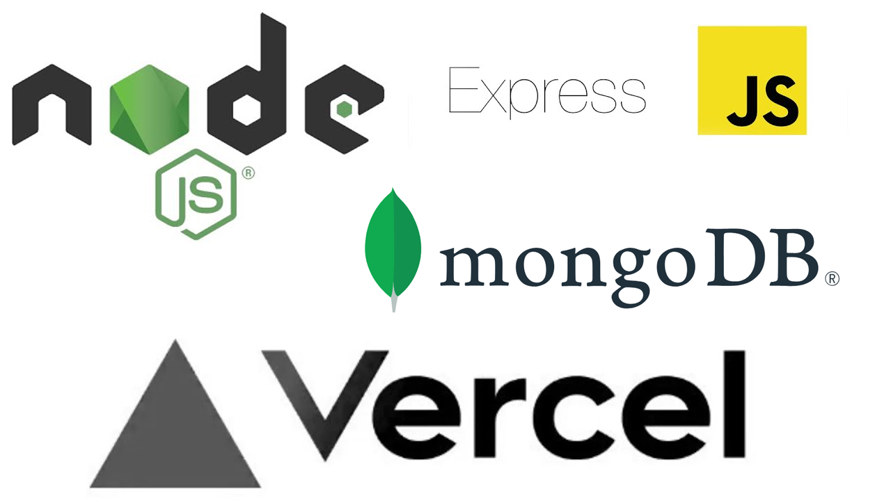

# Todo App Server

This is a Express.js server for a Todo application. It provides an API to manage todos with basic CRUD operations.

## Features

- Fetch todos based on the `userId` query parameter.
- Create a new todo with the `POST /todos` endpoint.
- Update a todo with the `PATCH /todos/:id` endpoint.
- Delete a todo with the `DELETE /todos/:id` endpoint.
- Automatic server refresh with Nodemon.

## Technologies Used

- Node.js
- Express.js
- MongoDB (Atlas)
- Nodemon
- Cors
- Body Parser

## Getting Started

1. Let's fork repository.
2. Clone the repository: `git clone https://github.com/your-username/todos_backend.git`
3. Navigate to the project directory: `cd todo-app-server`
4. Install the dependencies: `npm install`
5. Start the server: `npm start`

The server will be running on `http://localhost:3000`.

## API Endpoints

### GET /todos

Fetches todos based on the `userId` query parameter.

Example: `GET /todos?userId=123`

### POST /todos

Creates a new todo.

Example: `POST /todos`

Request Body:
```json
{
  "userId": 123,
  "title": "Some cool task",
  "completed": false
}
```

### PATCH /todos/:id

Updates a todo with the specified `id`.

Example: `PATCH /todos/456`

Request Body:
```json
{
  "title": "Updated cool task",
  "completed": true
}
```

### DELETE /todos/:id

Deletes a todo with the specified `id`.

Example: `DELETE /todos/789`

## Notes

- The server uses MongoDB as the database to store todos.
- The server automatically sets the `createdAt` field when a todo is created and updates the `updatedAt` field when a todo is updated.
- Also the server automatically sets `id` when creating a todo.

Feel free to explore the code and customize it according to your requirements.

# Deploying to Vercel

### Here is a step-by-step guide on how to deploy your application to Vercel based on the provided notes:

1. Run the command `vercel login` to log in to your Vercel account. If you don't have an account yet, you can create one on the [Vercel website](https://vercel.com/).

2. Execute the command `vercel` in your project directory. This will initialize the Vercel project and guide you through the configuration process.

3. During the configuration process, you will be prompted to specify the root directory of your project. Provide the path to the directory where your app.js file or main server file is located.

4. Next, you will be asked to set up your project settings, such as the name of the project and the framework used. Select the appropriate options based on your project.

5. Vercel will then analyze your project and attempt to detect the appropriate framework. If it correctly identifies your project as an Express.js application, it will proceed with the deployment process.

6. Once the deployment process is complete, Vercel will provide you with a deployment URL where your application is accessible online. You can access your deployed application using this URL.

7. Vercel also offers additional features such as environment variables, custom domains, and more. You can further configure your project by visiting the Vercel dashboard or using the Vercel CLI.

## License

This project is licensed under the [MIT License](https://opensource.org/licenses/MIT).
